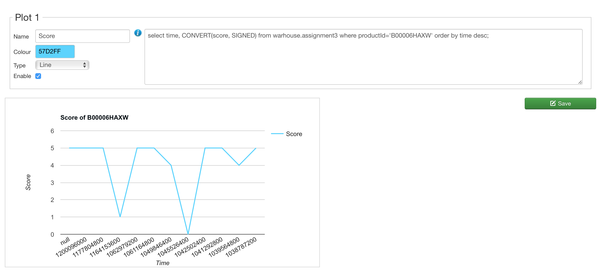
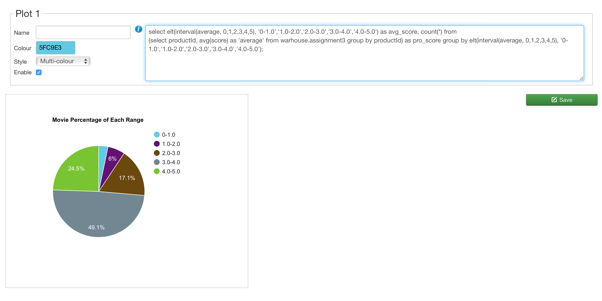
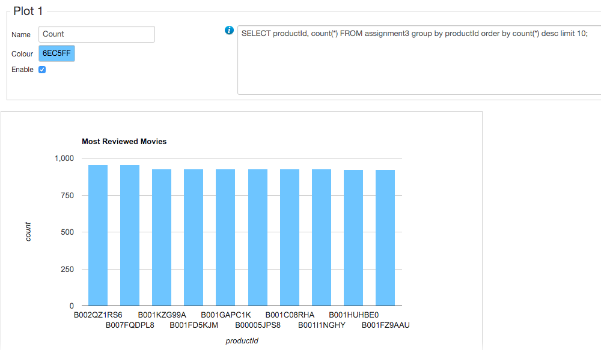
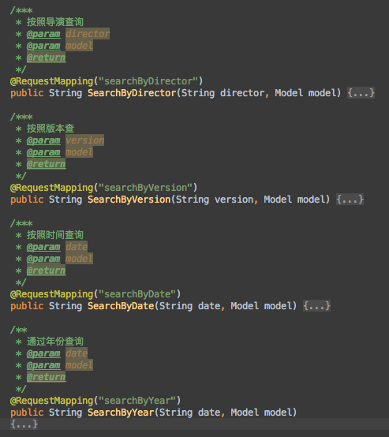
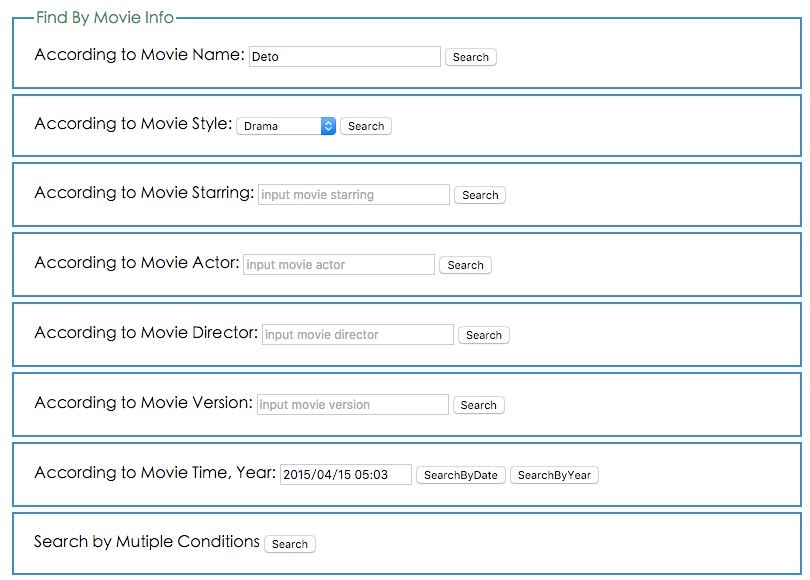
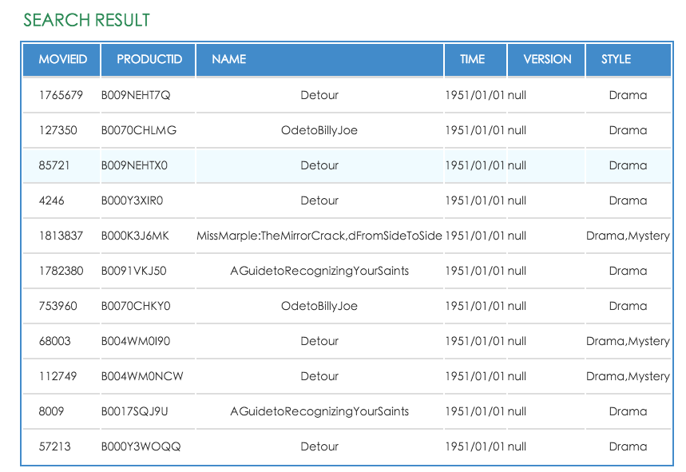
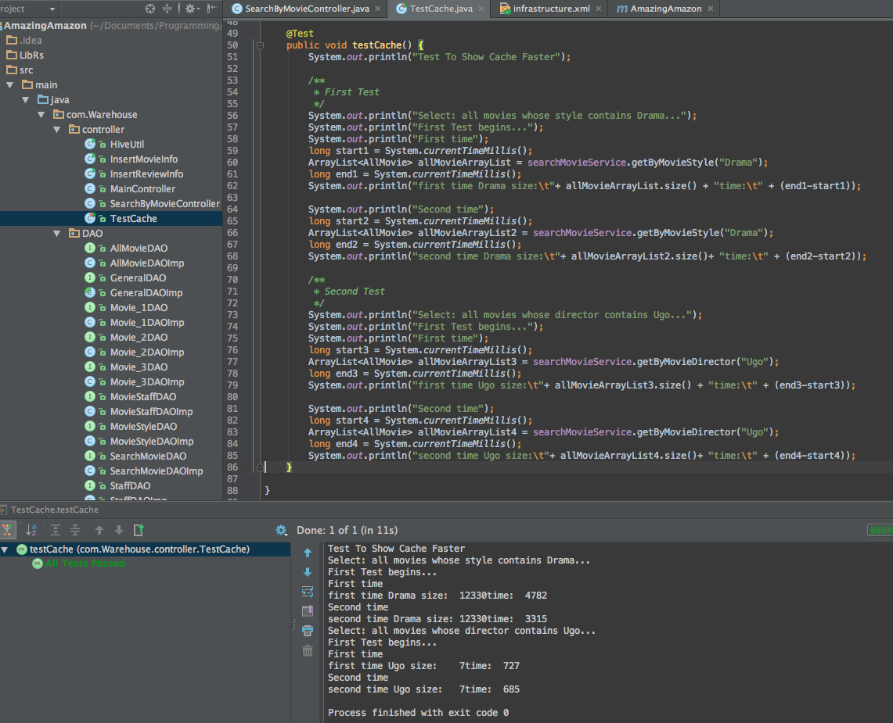

# Data Warehouse Project
# 2015年同济大学数据仓库期末课程项目设计


## 项目要求
* 针对电影及其周边信息，建立基于关系型数据仓库和分布式文件型数据仓库系统，并进行系统性能比对
	* 能够从数据来源处获取数据
	* 建立关系型数据仓库存储模型，存储数据
	* 建立分布式文件系统存储模型，存储数据
	* 在数据展现的界面上能够执行数据应用中的查询，并将在两种不同存储模型上的执行时间以数值的方式和图表的方式显示在界面上
* 数据来源：数据来源自Snap的文本文件和Amazon网站，数据包括但不限于以下信息：
	* 电影ID
	* 评论用户ID
	* 评论用户ProfileName
	* 评论用户评价Helpfulness
	* 评论用户Score
	* 评论时间Time
	* 评论结论Summary
	* 评论结论Text
	* 电影演员
	* 电影上映时间
	* 电影风格
	* 电影导演
	* 电影主演
	* 电影演员
	* 电影版本等信息。
* 数据应用：常见查询及统计（占总查询数目）=80%）：
	* 按照时间进行查询及统计（例如XX年有多少电影，XX年XX月有多少电影，XX年XX季度有多少电影，周二新增多少电影等）
	* 按照电影名称进行查询及统计（例如 XX电影共有多少版本等）
	* 按照导演进行查询及统计（例如 XX导演共有多少电影等）
	* 按照演员进行查询及统计（例如 XX演员主演多少电影，XX演员参演多少电影等）
	* 按照电影类别进行查询及统计（例如 Action电影共有多少，Adventure电影共有多少等）
	* 按照上述条件的组合查询和统计

## 数据来源
[Stanford EDU WEB Movie](http://snap.stanford.edu/data/web-Movies.html)


## 项目实现
### 项目平台
* 实现平台：Mac OSX
* J2EE框架：SpringMVC+Hibernate+Spring+EhCache
* Hive数据库：建立在Hadoop分布式集群
* Mysql：本机数据库
* 清洗数据：Data Integration

### 项目实现流程

#### 第一阶段 Review 部分
* 配置PHP环境
* 配置Joomla
* 引入Plotalot绘制SQL结果

#### 第二阶段 Movie 部分
* 爬虫抓取数据
* 清洗数据（最终23万条数据）
* 导入MySQL数据库和Hive数据库
* 分表优化，MySQL数据库建立Merge引擎
* 建立基于Spring+SpringMVC+Hibernate的J2EE框架
* 实现前端展示页面和Service，DAO层
* 前后端整合
* 引入EhCache，配置Hibernate二级缓存和query缓存，加速数据加载

### 项目实现结果
#### Joomla连接Review数据库测试结果样例
-
#### 按照时间查询某部电影的评分

#### 所有评分区间分配表

#### 评价数量最多的十部电影

#### 第二阶段电影信息搜索结果样例
-
#### 后台接口样例

#### 搜索界面

#### 搜索结果展示

#### Cache优化的JUnit测试



## 使用方法
将项目clone到本地，即在命令行输入：

``` 
$ git clone https://github.com/anzhehong/DataWareHouse

```

##Members:
<strong><a href="https://github.com/stars/xdliu002">刘旭东</a>,
<strong><a href="https://github.com/Jasminekiki">曹琦</a>

## 致谢
#### 最该感谢的是队友们的倾情付出！
另外，下面这篇文章对于我们建立cache有莫大的帮助，感谢[作者](http://www.hevi.info/)！

[Maven 3 + Hibernate 4 + Spring 3 + Ehcache + Spring Cache](http://www.hevi.info/2014/07/maven-3-hibernate-4-spring-3-ehcache-spring-cache/)